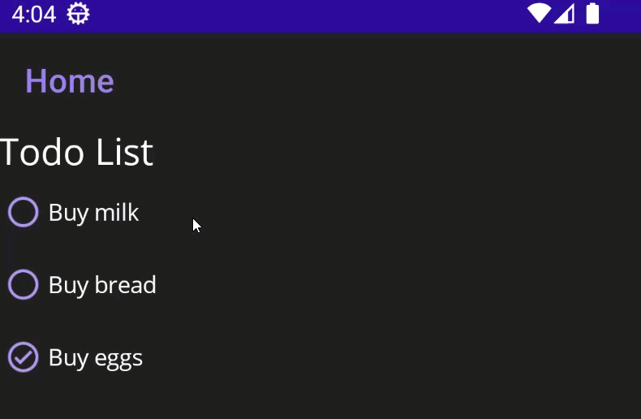

# IconImageSourceBug

Demonstrate a bug That shows how images colors are modified as soon as they are used as an IconImageSource in a Button.
Notice how the color of the checkmark changes when the swipe button is pressed and the collection item modified.

